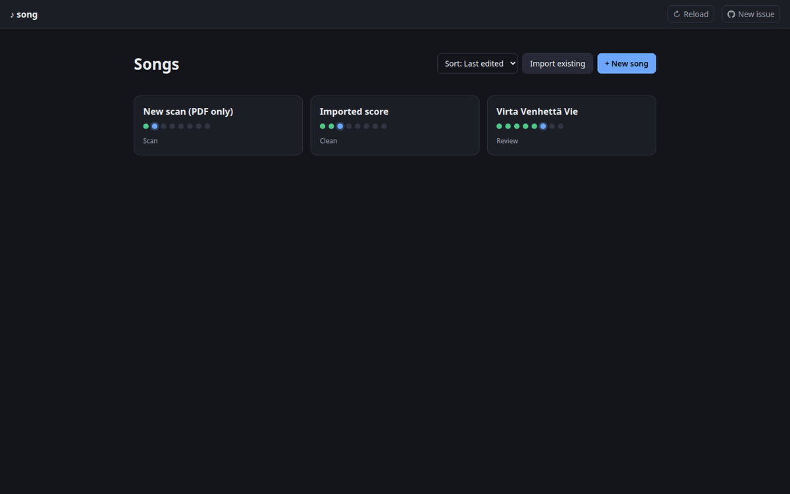
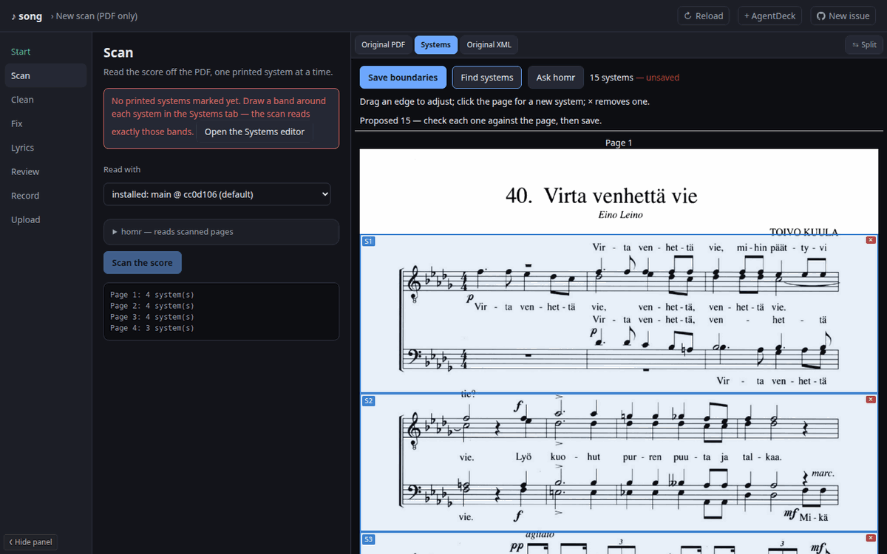
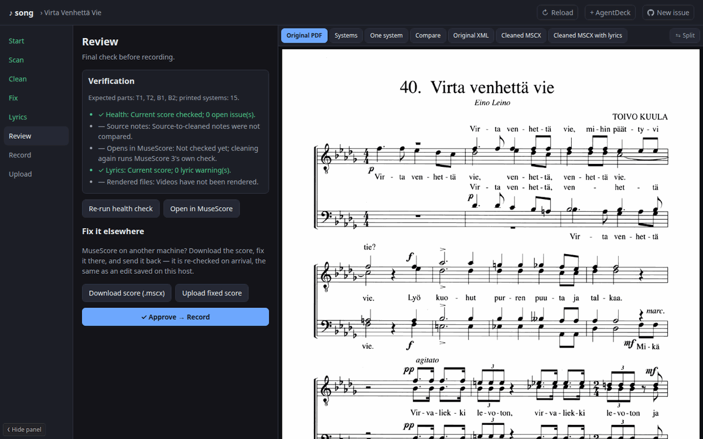
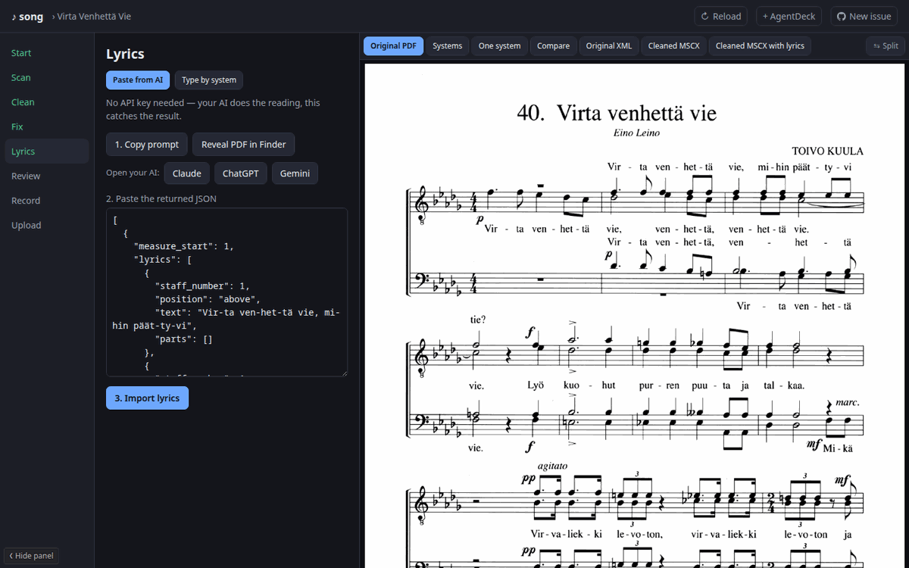
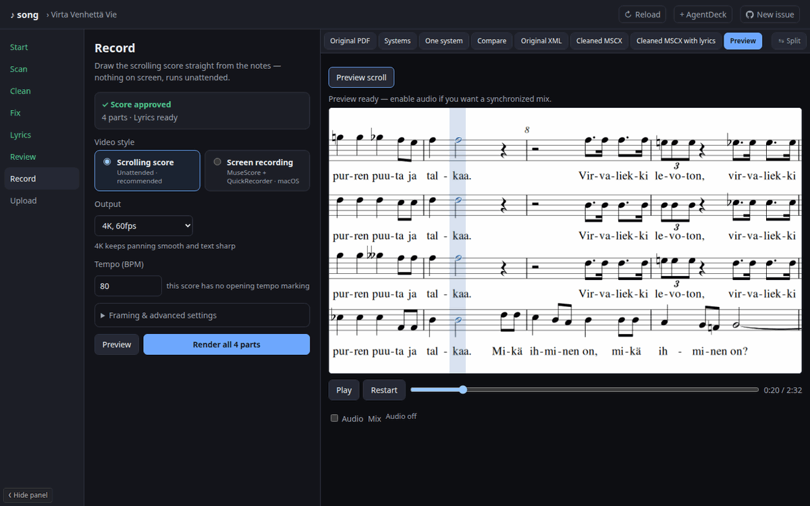
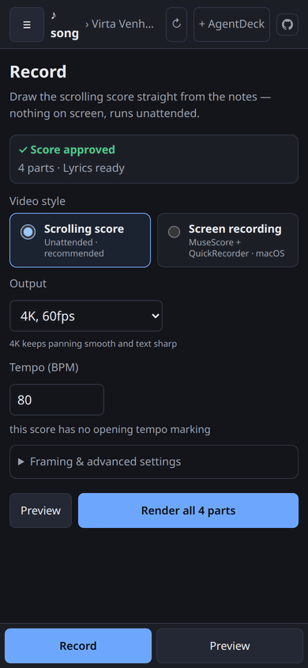

# song — choir practice tracks from sheet music

A small web app that turns a choir score into practice videos: one video per
voice, the score scrolling past with the sounding notes lit up, and that voice
louder than the others in the mix. It runs on your own machine and works from a
phone as well as a desktop.

You bring the sheet music as a **PDF** (or a score file you already have). The
app walks one song at a time through a fixed set of stages, remembers where each
song is, and keeps the printed page on screen next to whatever you are doing.



## The stages

Each song moves left to right along the stage list. You can go back to an earlier
stage at any time; redoing one clears only what depended on it.

1. **Start** — name the song and give it a PDF, a score file, or both. A PDF on
   its own starts at Scan; a score file skips scanning and starts at Clean.
   Choose whether it is a men's, women's or mixed choir, which decides how the
   parts are named.
2. **Scan** — read the notes off the PDF. Mark where each printed system (one
   line of music across all the staves) sits on the page — *Find systems*
   proposes them and you drag the edges to fix them — then press *Scan the
   score*. Each system is read separately by [homr](https://github.com/eerovil/homr),
   an optical music reader, and you compare every system with the page before
   approving the result. A system that came out wrong can be read again on its own.
3. **Clean** — split staves that carry two voices into one staff per voice and
   name the parts (S1, A1, T1, B1, …). When the staves change parts from one
   system to the next, you fill in a small grid saying who sings on which staff.
4. **Fix** — a health check lists bars that look damaged: a voice that does not
   fill its bar, an extra voice, a bar longer than its time signature. Fix them in
   MuseScore — on this machine, or download the score, fix it anywhere and upload
   it back. Recorded fixes (for example a slur the scan missed) are kept in
   `fixes.json` and applied again every time the song is cleaned.
5. **Lyrics** — either paste lyrics from your own AI chat (copy the prompt, give it
   the PDF, paste the answer back; no API key needed) or type them system by
   system. The app shows where the words and the notes do not match up.
6. **Review** — one place that says whether the score is ready: health, lyrics,
   whether MuseScore 3 will open the file. Approve it to move on.
7. **Record** — render the videos. Preview the scrolling picture in the browser
   first, adjust tempo, margins and which parts share a staff, then render every
   part (plus an *ALL* mix) unattended.
8. **Upload** — send the videos to YouTube, into a playlist if you like. Renaming
   the song later retitles the uploaded videos too.

 

 

The right-hand viewer switches between the original PDF, single printed systems,
the scanned score and the cleaned score (with and without lyrics), and can split
into two panes to compare any two of them.

## On a phone

Below tablet width the stage panel and the score are shown one at a time, with a
bar at the bottom to switch between them. The stage list slides in from the ☰ in
the header, and the score zooms with a pinch or its − / + / Fit buttons. The app can
be installed to the home screen (see [docs/PWA.md](docs/PWA.md)).



## Running it

```bash
./song.py                 # starts the server and opens the browser
./song.py --no-browser    # just the server
./song.py --port 8123     # prefer a port (the next free one is used if it is taken)
```

`song.py` uses the project's virtualenv (`.venv/bin/python song.py` if `.venv` is
not active). Setting up a machine — Python, MuseScore 3, ffmpeg, poppler, and the
optional homr install — is in **[SETUP.md](SETUP.md)**. homr can also be installed
or updated from the Scan stage, in its *homr* box.

Each song is a folder under `songs/` with its state in `songs/<song>/.song.json`.
The songs are copyrighted sheet music, so they live in a separate private
repository cloned into `songs/`.

## More

- [CHANGELOG.md](CHANGELOG.md) — what changed, and when.
- [TOOLS.md](TOOLS.md) — the command-line tools the app is built on
  (`clean_score.py`, `lyric_txt.py`, `scroll_video.py`, `record_stemmanauha.py`)
  and the MuseScore 3 plugins in `plugins/`.
- [DESIGN.md](DESIGN.md) — why the app is shaped the way it is.
- [SETUP.md](SETUP.md) — setting up a new machine.
- [CLAUDE.md](CLAUDE.md) — detailed notes for whoever works on the code.
